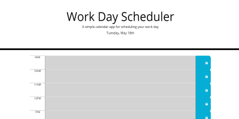

# WorkDayScheduler

The purpose of this project is to create a Work Day Scheduler in order for the user to be able to schedule and save events for the current day.

The URL for this website is: https://sjlevalley.github.io/WeatherDashboard/

## Installation

This website requires no special programs for viewing.

## Usage

This website is interactive and takes user input to function

## Credits

Credit for this website goes to the UCSD-Extention Coding Bootcamp

## License

---

## Badges

None

## Features

There are no special features in this project.

## How to Contribute

N/A

## Tests

N/A
